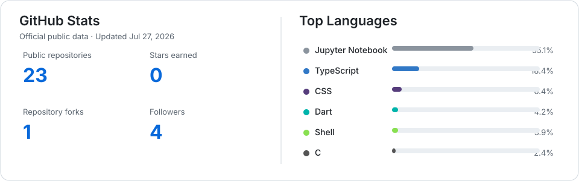

<div align="center">

# Nassim Fatnassi Hnifi

**Software Engineer · Cloud, DevOps & Platform Engineering**

I build and operate software from application code to production infrastructure—combining full-stack engineering, cloud-native delivery, automation, observability, and systems administration.

[](https://www.linkedin.com/in/nassim-fatnassi-hnifi-a1698a186/)
[](mailto:Fatnassihnifi.nassim@proton.me)
[](https://drive.google.com/file/d/1-ql96PCwiaMvd_C-gh1tQtg7pnUA3oP3/view?usp=sharing)
[](https://github.com/nassimfatnassi1999)

`Cloud Architecture` · `Kubernetes` · `CI/CD` · `Infrastructure as Code` · `Full Stack` · `AI-enabled Products`

</div>

---

## 👋 About me

I am a software engineer focused on the intersection of **cloud infrastructure, DevOps, platform engineering, full-stack development, and systems operations**. My work spans TypeScript applications, mobile products, container platforms, cloud automation, production deployment, monitoring, and infrastructure security.

- 🔭 Currently working as a **Full Stack & Systems Engineer at APPRENSUR**.
- ☁️ Previously worked on Azure infrastructure, Kafka on AKS, and observability at **Devoteam**.
- 🧩 Comfortable moving across application, data, platform, and operating-system layers.
- 🌍 Professional working proficiency in **Arabic, French, and English**.
- 🤝 Interested in Cloud, DevOps, Platform, Full Stack, and applied AI engineering opportunities.

> I learn systems by building them, operating them, and documenting the decisions behind them.

## 🎯 Areas of expertise

| Domain | Focus |
| --- | --- |
| **Cloud & platform** | AWS, Microsoft Azure, Google Cloud, OpenStack, cloud architecture, AKS |
| **DevOps & delivery** | CI/CD, GitOps, Jenkins, GitLab CI/CD, Argo CD, release automation |
| **Containers** | Docker, Docker Compose, Kubernetes, Helm, Strimzi |
| **Infrastructure** | Terraform, OpenTofu, Ansible, Bash, Linux VPS, Nginx, PM2 |
| **Full stack** | NestJS, Next.js, React, TypeScript, Flutter, Spring Boot, Laravel |
| **Data & messaging** | PostgreSQL, MySQL, Prisma, Redis, MinIO, Apache Kafka |
| **Operations** | Prometheus, Grafana, Zabbix, EFK, Loki, logging, alerting, backup and restore |
| **Systems & networking** | Linux, Windows Server, TCP/IP, DNS, DHCP, VLAN, VPN, firewall, SSH |
| **Security** | RBAC, JWT, TLS, UFW, Fail2ban, pfSense, OpenVPN, Trivy, Vault, Snort IDS |
| **Applied AI** | Speech-to-text, LLM-assisted content generation, Python, Jupyter-based analysis |

## 🧰 Technology stack

The stack is grouped by engineering responsibility instead of presented as an undifferentiated badge collection.

| Category | Technologies |
| --- | --- |
| **Languages** | TypeScript, JavaScript, Python, Go, Java, Dart, Bash, C, C#, PHP, HCL, YAML |
| **Frontend & mobile** | React, Next.js, Angular, Flutter, Vite, Tailwind CSS, Bootstrap |
| **Backend & APIs** | NestJS, Node.js, Spring Boot, .NET, Laravel, Beego, REST, Swagger/OpenAPI, WebSocket |
| **Cloud platforms** | AWS, Azure, GCP, OpenStack, AKS |
| **Containers & orchestration** | Docker, Docker Compose, Kubernetes, Helm, Strimzi |
| **Infrastructure as Code** | Terraform, OpenTofu, Ansible, OpenStack Heat |
| **CI/CD & GitOps** | Jenkins, GitLab CI/CD, Argo CD, Git, GitHub, SonarQube/SonarCloud, Nexus |
| **Databases & storage** | PostgreSQL, MySQL, MongoDB, Oracle Database, Redis, MinIO, NFS, Ceph, RAID |
| **Messaging** | Apache Kafka, Strimzi, Socket.IO |
| **Monitoring & logging** | Prometheus, Grafana, Zabbix, EFK, Loki, Promtail |
| **Operating systems** | Linux—Ubuntu, Manjaro, Pop!_OS—and Windows Server |
| **Virtualization** | VMware, Proxmox, KVM, VirtualBox, Vagrant |
| **Networking & security** | TCP/IP, DNS, DHCP, HTTP/S, VLAN, VPN, SSH, pfSense, OpenVPN, Snort, UFW, Fail2ban, Trivy, Vault |
| **AI / ML** | Deepgram speech recognition, Groq-hosted LLM workflows, Python, Jupyter Notebook |

<details>
<summary><strong>How these capabilities connect</strong></summary>

```text
React / Next.js / Flutter
          ↓
NestJS / REST / WebSocket ──→ PostgreSQL / Redis / MinIO / Kafka
          ↓
Docker ──→ Kubernetes / AKS ──→ AWS / Azure / GCP / OpenStack
          ↓
Terraform / Ansible / Argo CD / Jenkins
          ↓
Prometheus / Grafana / EFK / Zabbix
```

</details>

## 🚀 Featured projects

| Project | Engineering highlights |
| --- | --- |
| **[Stockini](https://github.com/nassimfatnassi1999/stockini)** | Spare-parts stock management platform built with **Next.js, NestJS, PostgreSQL, Prisma, React Query, Tailwind CSS, MinIO, and Docker Compose**. Separates dashboard, API, database, and object storage concerns; includes JWT authentication, Swagger documentation, migrations, seeding, Makefile workflows, production deployment scripts, and integrity-checked PostgreSQL/MinIO backup and restore. |
| **[Z — AI Voice Messaging](https://github.com/nassimfatnassi1999/z-app-backend)** · **[Mobile UI](https://github.com/nassimfatnassi1999/z-flutter-UI)** | A **Flutter + NestJS** application that turns multilingual speech into structured professional messages. The backend combines Deepgram transcription, LLM-assisted generation, PostgreSQL/Prisma, JWT, Socket.IO discussions, email verification, and Firebase notifications. Docker-based deployment includes health checks, environment validation, migration checks, and operational scripts. |
| **[KubeMastery](https://github.com/nassimfatnassi1999/kubeMastery)** | Offline-first **Flutter** learning companion for Kubernetes fundamentals and KCNA, CKAD, CKA, and CKS preparation. Uses a layered architecture, Provider, Hive, Freezed, bundled JSON content, widget tests, progress analytics, flashcards, and exam simulations. Runs without an account, backend, or network connection. |
| **[Kafka + Argo CD GitOps](https://github.com/nassimfatnassi1999/kafka-argoCD)** | Declarative Kubernetes platform for **Apache Kafka with Strimzi**, continuously delivered through Argo CD. Kustomize-managed applications add AKHQ, Prometheus/Grafana monitoring, alerting, and centralized EFK logging; the companion **[Kafka on AKS](https://github.com/nassimfatnassi1999/Kafka-kubernetes)** project provisions Azure infrastructure with Terraform. |
| **[DevOps Toolbox](https://github.com/nassimfatnassi1999/scripts-bash)** | Portable Bash automation for Linux/macOS administration, cloud CLIs, Docker, Kubernetes, Terraform/OpenTofu, Ansible, Jenkins, backups, networking, security, and troubleshooting. Includes a shared library, central launcher, dry-run support, safety confirmations, Bash syntax validation, ShellCheck, and shfmt integration. |

<details>
<summary><strong>More public engineering work</strong></summary>

- **[ESPREAT](https://github.com/nassimfatnassi1999/ESPREAT)** — Angular/Spring Boot microservices deployed to Azure Kubernetes Service with Terraform.
- **[OpenVPN VM](https://github.com/nassimfatnassi1999/OpenVpn-VM)** — Terraform-backed VPN infrastructure and Linux client setup documentation.
- **[Beego JWT API](https://github.com/nassimfatnassi1999/beego-jwt-vergo)** — Go REST API using Beego, JWT authentication, and MySQL.
- **[Library Management System](https://github.com/nassimfatnassi1999/Library-Management-System)** — Go CLI for catalog, user, lending, and return workflows.
- **[Portfolio](https://github.com/nassimfatnassi1999/portfolio-nassim)** — Bilingual React/TypeScript portfolio with role-specific Cloud, Software, and Systems views.

</details>

## 💼 Professional experience

| Period | Role | Impact and scope |
| --- | --- | --- |
| **Jan 2025 – Present** | **Full Stack & Systems Engineer · APPRENSUR** | Builds CRM and business applications with React, Next.js, NestJS, PostgreSQL, Prisma, MinIO, JWT, and RBAC. Operates Linux VPS deployments with Nginx, PM2, TLS, backups, CI/CD, monitoring, troubleshooting, and performance work. |
| **Feb 2025 – Aug 2025** | **Cloud Engineer · Devoteam** | Designed and automated Azure infrastructure; deployed Kafka on AKS with Strimzi; implemented monitoring and centralized logging with Prometheus, Grafana, and EFK. |
| **Jun 2024 – Aug 2024** | **DevOps Engineer Intern · Capgemini Engineering** | Built a full-stack application and automated its delivery pipeline; containerized and orchestrated services with Docker and Kubernetes. |
| **Jul 2023 – Sep 2023** | **Full Stack Engineer Intern · BH Bank** | Developed a Laravel, MySQL, and Bootstrap application that digitized trainee and HR workflows. |
| **Feb 2021 – Jun 2021** | **IT Technician Intern · Tunisair Technics** | Built an RFID-based stock-management system with JavaFX and MySQL for tracking aircraft parts. |

## 🎓 Education & certification

| Education | Institution | Period |
| --- | --- | --- |
| **National Engineering Degree in Computer Science** — Cloud Computing, DevOps, Software Engineering, Networking, Distributed Systems | ESPRIT, Tunisia | 2022 – 2025 |
| **Bachelor's Degree in Mechatronics Engineering** — Industrial Automation, Embedded Systems, Networks, IT Infrastructure | ISET Béja, Tunisia | 2018 – 2021 |

| Certification | Issuer | Validity |
| --- | --- | --- |
| **[MultiCloud Network Associate](https://www.credly.com/badges/b518bd52-eba0-4859-aaf7-d8d671686ea2/public_url)** | Aviatrix | Valid through September 2028 |

## 🌱 Current learning

- Deepening **AI/ML engineering** through speech recognition, LLM-assisted workflows, and practical product development.
- Building structured knowledge across **Kubernetes architecture, application workloads, security, and CNCF certification domains** through KubeMastery.
- Refining production practices for **GitOps, observability, backup integrity, platform security, and reliable cloud delivery**.

## 🌐 Open source & public engineering

My public repositories focus on reusable learning tools, infrastructure examples, automation, and complete product implementations. Current themes include Kubernetes education, DevOps scripting, Kafka operations, Terraform provisioning, Go APIs, and Flutter applications.

- Issues and focused pull requests are welcome where a repository's contribution guidance allows them.
- Each repository documents its own licensing status; public source availability should not be assumed to grant reuse rights without a declared license.
- I value reproducible setup instructions, architecture notes, safe automation, and operational documentation alongside code.

## 🔬 Research, hackathons & applied innovation

**[FairAid — Empower X-Hack](https://github.com/nassimfatnassi1999/Hackathon_Blockchain)** explores transparent aid distribution through AI-assisted demand analysis, blockchain transaction traceability, and smart-contract automation. The repository includes Jupyter-based analysis material, the application/contract package, and project documentation.

## 📊 GitHub activity

<div align="center">

<a href="https://github.com/nassimfatnassi1999">
  <picture>
    <source media="(prefers-color-scheme: dark)" srcset="./assets/profile-overview-dark.svg">
    <source media="(prefers-color-scheme: light)" srcset="./assets/profile-overview-light.svg">
    
  </picture>
</a>

</div>

The card is generated weekly from the official GitHub REST API and stored in this repository—no statistics-card service is called when the profile loads. For the canonical contribution calendar and complete activity history, [view my GitHub profile](https://github.com/nassimfatnassi1999). Language percentages describe public repository content; they are not a measure of proficiency.

## 📬 Contact

| Channel | Link |
| --- | --- |
| **LinkedIn** | [nassim-fatnassi-hnifi](https://www.linkedin.com/in/nassim-fatnassi-hnifi-a1698a186/) |
| **Email** | [Fatnassihnifi.nassim@proton.me](mailto:Fatnassihnifi.nassim@proton.me) |
| **Cloud & DevOps resume** | [View on Google Drive](https://drive.google.com/file/d/1-ql96PCwiaMvd_C-gh1tQtg7pnUA3oP3/view?usp=sharing) |
| **Software Engineering resume** | [View on Google Drive](https://drive.google.com/file/d/1EIeWTHW6uGZp7pi7e_jrUL7u_rhMprKl/view?usp=sharing) |
| **Portfolio source** | [github.com/nassimfatnassi1999/portfolio-nassim](https://github.com/nassimfatnassi1999/portfolio-nassim) |

---

<div align="center">

**Open to conversations about software engineering, cloud platforms, DevOps, infrastructure, and applied AI.**

</div>
